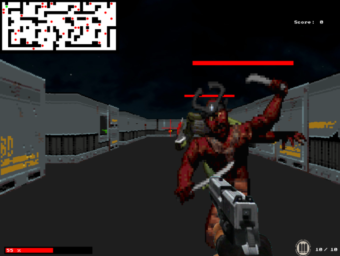
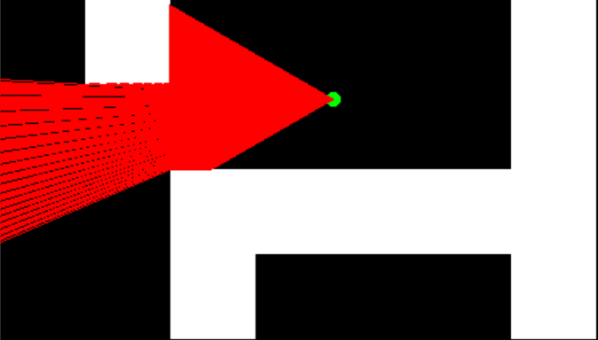

# Raycasting Video Game
<!-- PROJECT LOGO -->
 

  
  

    Raycasting video game in the same style of Doom or Wolfenstein 3D.
  

<!-- ABOUT THE PROJECT -->
## About The Project

A simple FPS video game with several type of enemies.
The goal is to kill all enemies, with different weapons, without the player's life reaching zero. But after 5sec during which the player has not been hit he recovers 1 life point per second.

The player move by using Z, Q, S, D keys (azerty keyboard), shoot by using left click, display pause menu thanks to H key and close pause menu with Q and change the settings by using arrows.

In the game everything is editable, the number of enemies, weapons, type of enemies and their stats, and the map.

  

 

I use raycasting algorithm and DDA algorithm to optimize that. The player projects lots of vectors that determine where the nearest wall is in order to return the distance.

And thanks to the distances I was able to display more or less large rectangles in order to create a perspective.

  

 

Gameplay available on Youtube :
  https://www.youtube.com/watch?v=Whu1s6VjVgY

 

## Built With

* [C Language](https://fr.wikipedia.org/wiki/C_(langage))
* [Allegro 4.4](https://www.allegro.cc/manual/4/api/)

<!-- USAGE EXAMPLES -->
## Usage

### On Windows

1 - Download [Allegro 4.4](https://liballeg.org/old.html)

2 - Compile with 
  `gcc ./src/*.c -lm -lalleg44 -lmingw32 -lwinmm -I./includes`

3 - Run
  `./a.exe`

---------------------------------------------------------------

### The conf input file should be as follows:

For enemies:

      numberOfEnemies
      filepath
      width to cut the sprite
      height to cut the sprite
      number sprite for walk anim
      number sprite for attack anim
      number sprite for death anim
      life
      dps
      speed
      points
      ...

For guns:

      numberOfGuns
      filepath
      number shoot sprite
      number reload sprite
      bullet number
      filepath reload sound
      filepath shoot sound
      ...

For map:

      number column
      number raw
      ...

It's possible to add/remove textures by adding/removing them in the file `./assets/texture.bmp`

<!-- CONTACT -->
## Contact

Gabriel Guiet-Dupré - [LinkedIn](https://linkedin.com/in/gabriel-guiet-dupre) - gabriel.guietdupre@edu.ece.fr

